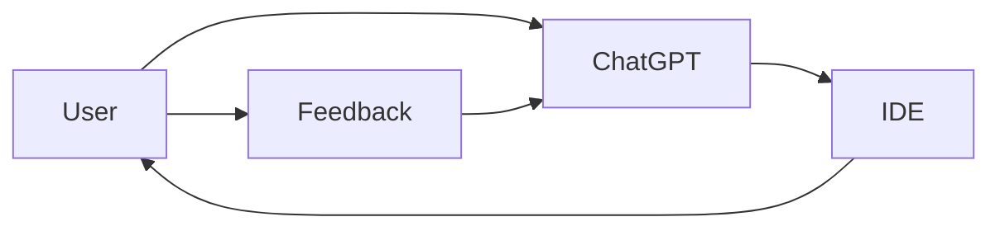
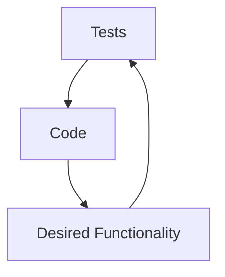
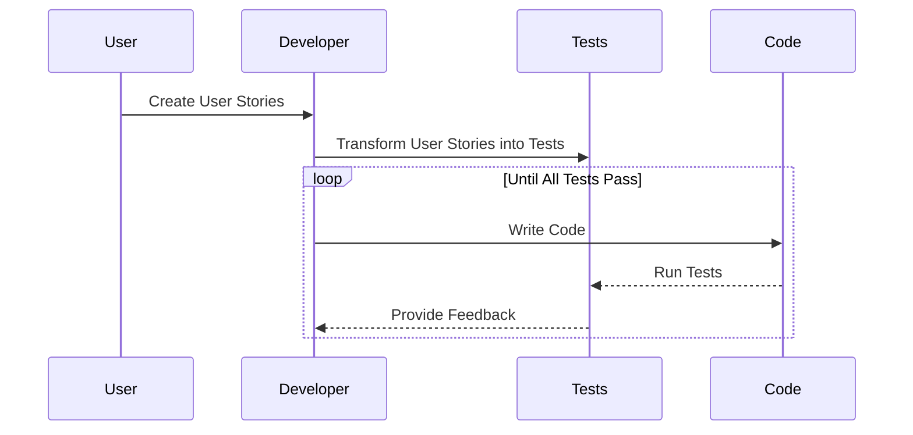
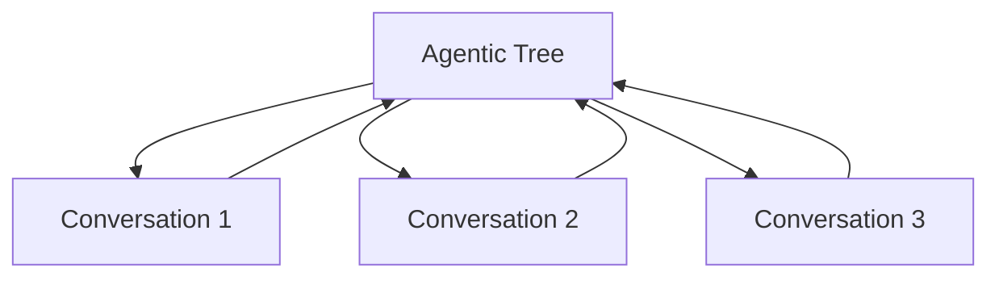

# Grounding: A Key Concept in Agentic Systems

## Introduction
Grounding is a crucial concept in the development of agentic systems, which are AI systems that can make decisions, perform actions, and interact with their environment. Grounding ensures that an AI agent's understanding and actions are aligned with the real world by anchoring them to tangible feedback and information.

## Grounding in ChatGPT and IDE

The iterative feedback loop between the user, ChatGPT, and the IDE creates a rudimentary grounding mechanism. However, this approach has limitations due to its reliance on the user's ability to provide comprehensive feedback and the chatbot's limited understanding of the code's intended behavior.

## The Power of Tests as Grounding

Writing tests before writing code is a powerful approach to grounding. Tests serve as a clear and objective specification of the expected behavior and requirements of the code. By defining the desired outcomes and edge cases through tests, developers can ensure that the code they write is aligned with the intended functionality.

## The Code Writing Process with User Stories and Tests

User stories capture user requirements and desired functionality in the code-writing process. The developer transforms these user stories into tests that define the expected behavior and outcomes of the code. The developer then writes code to pass the tests, refines the code based on the test results, and repeats the process until all tests are satisfied.

## Reverse Chatbot: Grounding through User Interaction

In an agentic system, a reverse chatbot scenario introduces a new approach to grounding. The AI agent initiates conversations with users to gather information, clarify requirements, and gain insights. These conversations serve as leaf nodes in the agentic tree, representing specific tasks or subtasks that the agent needs to accomplish. The insights obtained from these conversations propagate up the agentic tree, influencing higher-level decisions and actions.
