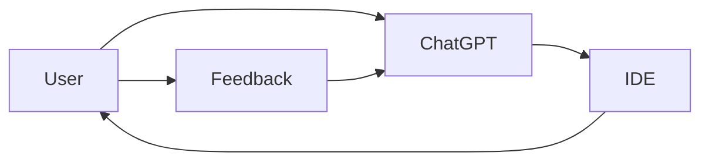
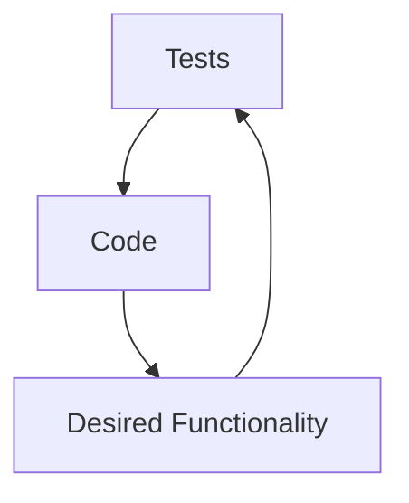
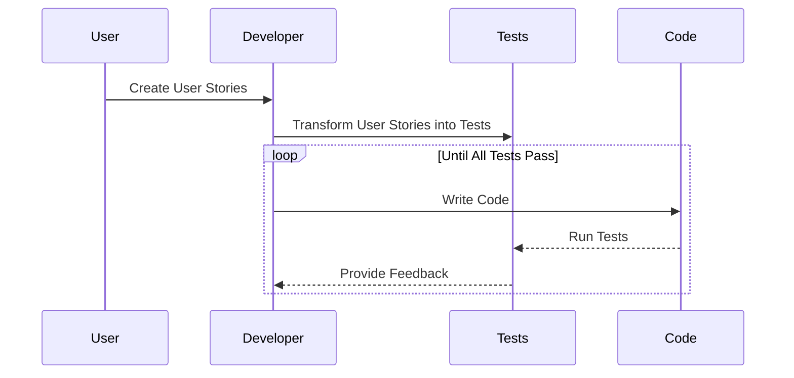
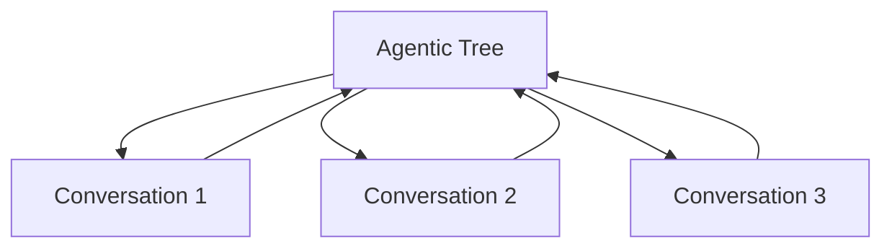

# Grounding is all you need

## Introduction
I'll talk about code generation, and how SOTA results can be achieved if we review some assumptions about how we interact with an agent.

## Interactions with an agent ? When, how, why ?

What would a great Software producing agent look like ?
Is it an entity that, given a prompt, produces a complexe software ?

You wouldn't want an agent that does that.

You wouldn't want that either from an employee.

What you want from your employee, and probably agent, is to involve you each time it's not certain about something.

To have a conversation with you about the directions to take, each time there is a direction to take.

Ideal agent would not be prompted once. You would prompt it your initial ideas, then you'd want your agent to engage conversations with you in order for the final result to match your specifications.

You don't have all specification at initial prompt time.

## Grounding, you're doing it already.

Imagine writing code with ChatGPT and an IDE.
You ask for the code via the chat interface, copy the code, paste it into your IDA

The iterative feedback loop between you (the user), ChatGPT, and the IDE creates a rudimentary grounding loop.

## The Power of Tests as Grounding

Writing tests before writing code is a powerful approach to grounding. Tests serve as a clear and objective specification of the expected behavior and requirements of the code. By defining the desired outcomes and edge cases through tests, developers can ensure that the code they write is aligned with the intended functionality.

## The Code Writing Process with User Stories and Tests

User stories capture user requirements and desired functionality in the code-writing process. The developer transforms these user stories into tests that define the expected behavior and outcomes of the code. The developer then writes code to pass the tests, refines the code based on the test results, and repeats the process until all tests are satisfied.

## Reverse Chatbot: Grounding through User Interaction

In an agentic system, a reverse chatbot scenario introduces a new approach to grounding. The AI agent initiates conversations with users to gather information, clarify requirements, and gain insights. These conversations serve as leaf nodes in the agentic tree, representing specific tasks or subtasks that the agent needs to accomplish. The insights obtained from these conversations propagate up the agentic tree, influencing higher-level decisions and actions.

## Assumptions

* Given User Stories, GPT-4 is able to write tests that match the specs

* User stories definitions should be grounded by conversation
* GPT-4 can solve tests.

## Conclusion

Outline the pipeline for SOTA code generation.