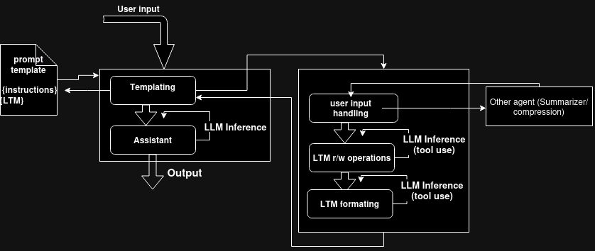

# About
Hi, I'm Valentin, I tinker with agentic.
I want to automate myself as a senior software engineer.

At some point, my framework will be open to contribution.

Right now, it's a resume project.

My current full time job is to work on this repo until I'm hired as an agentic engineer/researcher.

Want to hire me (or just chat) ? : v@lentin.fr

Cite me: 
[CITATION.cff](CITATION.cff)

# Agentix

Low boilerplate functional agentic.

## Motivations
[https://nuxt.com](Nuxt) is my inspiration. It's an extreme example of "hiding the complexity". I want to hide myself as much complexity as possible when I implement agents.

I want to be able to write arbitrary agentic pipelines with the minimum amount of code.


I want an intuitive formalism to implement agentic pipelines with clear logic flow.

File (and by extension, lib) structures are for humans. I want my framework LLM friendly.

## Limitations of Agentix
* The approach is not made for speed. We want the smartest agents, not the most performant
* Everything runs sequentially
## Python Magics
I use python magics to auto-import my agents, middlewares, tools.
If, somewhere within rightly name directories, a .py file exists and contains:
```python
from agentix import tool

@tool
def say_hello(name:str) -> str:
    return f'hello {name}'
```

Then anywhere else, you can just use it :
```python
from agentix import Tool

print(Tool['say_hello']('world'))
```
## Theory
[Agentic paradigms](AgenticParadigms.md)
[Grounding is all you need](Soon.md)

## Agentix's assumptions
### Agents are functions


**Black box description** (as opposed to *implementation details*):
From the outside, an agent is conceptually a function. It ingests inputs and return outputs of given types.
While this principle is simple and doesn't look like much, it proved unsuspectedly powerful to implement complex control flow over LLM inferences.

**Agentic Single Responsibility Principle**: A given agent (as should, ideally a function), should do ONE task, and have as few in context tools as possible.

**Exemple of control flow with agentFlow**
```python
for task in Agent['taskLister'](user_input):
    Agent['taskExecutor'](task)
```

Here's an actual piece of code I used to implement a long term memory:


```python
for fact in Agent['LTM_fact_extract'](user_input):
    Agent['LTM_fact_store'](
        Agent['LTM_compress_fact'](fact)
        )

context = Agent['LTM_fact_recall'](user_input)
```


It allows for strong algorithmic decoupling, which in turn makes easy to have very specialist agents.

Akin to a function, an agent can itself be an arbitrarly complexe set of agents. Resulting for a given task in many contexts/conversations.

**Note**: One thing I first thought as a tradeoff: my approach is heavy in LLM calls. In reality, it's balanced by the fact it requires overall less tokens generated than other approachs (when done correctly). Also, some Agents can run with `gpt-3.5-turbo`.

_______________


**experimental takeaway of this approach**
* Increase overall performance
* Multi-LLM architecture (some tasks can be handled by _gpt-3.5-turbo_, ) with gains in both speed and cost.

_____________________


### Agents are stacks of middlewares

Time to get our hands dirty


## Agents as stacks of Middlewares (inside view/implementation details)
**Inside**:
From the inside an agent is a stack of ordered middlewares.
Each middleware should only contain agent core logic.
(Printing, streaming, logging... should not ever be middlewares concern)

An agent is instanciated by a string representing the middlewares that composes it

### Primitive types
`Conversation` is an entity composed of value objects `Message`s.

`MW`, `Tool` and `Agent` are containers (`__getitem__(self, key:str)`), holding respectively: middlewares, tools and agents.

`mw` and `tool` are decorators

(That will become clearer when we'll walkthrough agents implementation)


A conversation contains flags, one of them is `should_infer`.

if a middleware returns a conversation with `should_infer` flag to `True`, the conversation is fed to a LLM (specified with a flag, `gpt-4` default) then fed back to the same middleware.
In all other cases, the output of a middleware is fed to the next, and the output of the last middleware is the output of the agent.

____

Giving this execution flow:


____

(As for a real life illustration, here's what the flow of an LTM agent with only passive memory could look like)




## Agentix tools
TODO: explain auto-import
TODO: explain tool
TODO: explain agent file structure


## Install
```bash
git clone https://github.com/valentin-dion/Agentix.git
cd Agentix
pip install -e .
```
### run gradio
### create new agent
```bash
agentix create MyAgent
```
it will create all the boilerplate you need to create an agent.

AKA this file structure:
```
📂 agents
  📂 MyAgent
    ├ 📂 agents
    │ └ 📄 MyAgent.py
    ├ 📂 middlewares 
    │ └ 📄 MyAgent_loop.py
    ├ 📂 prompts
    │ └ 📄 MyAgent.conv
    ├ 📂 tests
    └ 📂 tools

```

### run agent
```bash
agentix run MyAgent
```
### serve agent with gradio
**TODO**


## Create your first agents
### ShellGPT
an agent that handles the linux shell for you.

(or a linux console you can talk to in natural language)

[ShellGPT Walkthrough using TDD](ShellGPT_TDD.md) (TODO)

[ShellGPT Walkthrough not using TDD](ShellGPT.md) (Easy)

Both come to the same result
### LTM (WIP)
An conversationnal agent with Long Term Memory (Intermediate)
### Frontend component factory (TODO)
### Agent that codes its own tools (TODO)
### Components factory
## Debug
## Serve