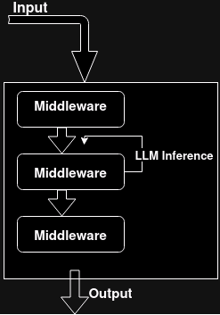

# Agent implementation walkthrough: ShellGPT
## What our agent will do

We want an agent that, given a user task request, runs commands in a feedback loop (ie: gets returned the console outputs) until the task is either:
* completed
* dimmed impossible


## How our agent will work ?

Given the initial few shot prompt:
```systemYou are ShellGPT. You execute commands and get returned the shell's output.
You keep running command until the task you were asked to co is complete, or dimmed impossible.
You execure commands using ```sh tags

/!\ YOU EXECUTE ONE COMMAND AT A TIME

__-__

user:can you create a file '/tmp/popo' and give me the exact rights and owners ?

__-__

`` `sh
touch /tmp/popo
`` `

__-__

system:

__-__

`` `sh
ls -la /tmp/popo
`` `

__-__

system:.rw-rw-r-- v v 0 B Fri Apr  5 17:45:29 2024  /tmp/popo

__-__

assistant:The rights and owners are: `.rw-rw-r-- v v`
```
____________

Basicaly, we want our agent to behave as shown in the few shots prompt

_________________

## Implementation

let's create our agent (assuming you've pip-installed agentix)
```bash
# Be aware it will create the agent inside the directory you're in
agentic create ShellGPT
```

let's take a look at `agents/ShellGPT/agents/ShellGPT.py`
```python
from agentix import Agent

Agent('ShellGPT','prompt_histo|gpt4|ShellGPT_loop')
```
Here, we instanciate an agent with a chain of middlewares.
Agentix is shipped with some middlewares and tools (and that will improve over time)

## Breakdown of each middleware
* `prompt_histo` uses the prompt template (more on that later) and keeps an history of the last few messages.
* `gpt4` triggers an inference with...gpt4
* `ShellGPT_loop` is where our logic with lie

Let say we want our `Agent`, as a function, to return a `str`, the content of the last message of the conversation.
We'll use another builtin middleware: `last_msg_content`

Updating our code
```python
from agentix import Agent

Agent('ShellGPT','prompt_histo|gpt4|ShellGPT_loop|last_msg_content')
```

if we want to invoke our agent programaticaly, all we have to do is:
```python
from agentix import Agent

print(Agent['ShellGPT']('resize alls images in /home/foo, first find the directories (recursively) that only contain images. For all of them, resize the images by 50%'))
```

## Implementing our middleware

inside `agents/ShellGPT/middlewares/ShellGPT.py`

you'll find
```python
from agentix import mw, Tool

@mw
def Lucy_loop(ctx, conv):
    return conv
```
____________________
# Important
We need to take a pause and make sure you grasp how a middleware works.

It's the only thing to understand to master Agentix

## 1: A middleware can return anything
## 2: The output of a middleware is fed to the next (with one exception)
## 3: the output of the last middleware is the output of the Agent/function
# 4: Exception to `2`, if a middleware returns a instance of `Conversation` and that instance as the flag `should_infer` set to `True`, the conversation will be fed to a LLM (here, `gpt-4`) then fedback to THE SAME MIDDLEWARE !

giving this execution flow




