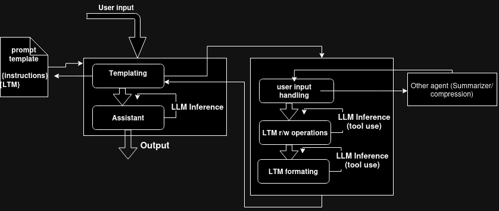

## Agents as stacks of Middlewares (inside view/implementation details)

From the inside an `Agent` is a stack of ordered middlewares.

Here's how to create an `Agent`.

```python
from agentix import Agent

Agent('MyAgent','middleware1|middleware2|...')
```


Each middleware should only contain agent core logic.
(Printing, streaming, logging... should not ever be middlewares concern)

An agent is instanciated by a string representing the middlewares that composes it

### Primitive types
`Conversation` is an entity composed of value objects `Message`s.

_____
**Side note, while I'm at it:**

`MW`, `Tool` and `Agent` are containers (`__getitem__(self, key:str)`), holding respectively: middlewares, tools and agents.

`mw` and `tool` are decorators

(That will become clearer when we'll walkthrough agents implementation)
____________

A `Conversation` contains flags, one of them is `should_infer`.

if a middleware returns a conversation with `should_infer` flag to `True`, the conversation is fed to a LLM (specified with a flag, `gpt-4` default) then fed back to the same middleware.
In all other cases, the output of a middleware is fed to the next, and the output of the last middleware is the output of the agent.

____

Giving this execution flow:


____

(As for a real life illustration, here's what the flow of an LTM agent with only passive memory could look like)




## How to implement/use middlewares ?

[Go here](README.md#here2)
